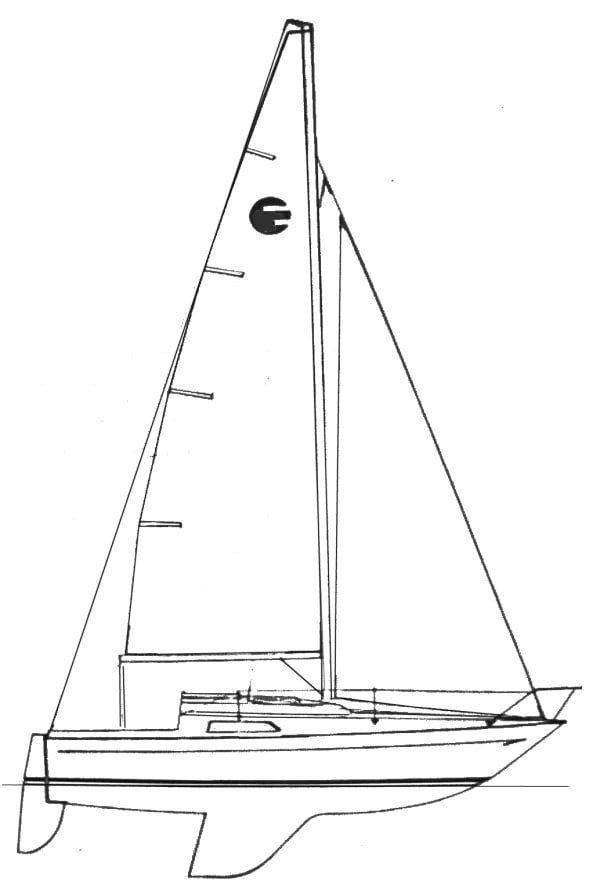

## Chilli
Naše **Chillina** byla vyrobena ve Francii firmou Yachting France / JOUËT v roce 1977. Jedná se o model **JOUËT 22**, který je také známý pod názvy ELOR 65 nebo Elvstrøm 6.5. Na jejím návrhu se podílel slavný jachtař **Paul Elvstrøm**, což se výrazně odráží v jejích výborných plavebních vlastnostech. Mezi lety 1974–1979 bylo vyrobeno více než **300 kusů**.

Loď má **ploutvo kýl** a **kormidlo zavěšené na zrcadle**, jehož list je ovládaný pomocí kormidelní páky. Trup je vyroben ze sklolaminátu, je tedy pevný, lehký a odolný.

**JOUËT 22** je oblíbená díky snadné ovladatelnosti, svižným jízdním vlastnostem a zároveň překvapivě prostornému interiéru. Vyniká také při plavbě proti větru, a proto je ideální volbou pro členy klubu, kteří si chtějí užít rychlou a zábavnou plavbu.

Pro větší komfort je naše loď vybavena navigačním osvětlením, osvětlením v kajutě a kosatka je navinuta na rollfoku, což výrazně usnadňuje manipulaci za plavby.

| Specifikace | Hodnota |
|-------------|---------|
| Celková délka (LOA) | 6,5m (21,33 ft) |
| Délka na hlavní vodorysce (LWL) | 5,45m (17,88 ft) |
| Šířka | 2.35 m |
| Výtlak | 1,4 m³ |
| Balast | 565 Kg |
| Plocha plachet | 20 m² |
| Motor | závěsný |
| Maximální posádka | 6 |
| Počet lůžek | 4 |

Zdroje:
- https://sailwiki.com/yacht/jouet-22-elor-65/
- https://sailboatdata.com/sailboat/jouet-22-elor-65/ (oficiální dokumenty lodě)

### Paul Elvström
**Paul Elvström** (1928–2016) patří mezi největší legendy světového jachtingu. Zúčastnil se **osmi olympiád**, z nichž si odvezl **čtyři zlaté medaile**, a k tomu získal **11 titulů mistra světa**. Za své úspěchy byl uveden do **jachtařské síně slávy**.

Elvström nebyl jen výjimečný závodník, ale také inovátor. Byl jedním z prvních, kdo začal aktivně používat **kicker** a tím získával výhodu nad soupeři. Navrhl také vlastní a dodnes používanou verzi **self-baileru**, která dokáže díky podtlaku pod lodí odsávat vodu z kokpitu. Jeho konstrukce byla oproti starším typům odolnější, spolehlivější a snadno ovladatelná.

Spolupodílel se také na vývoji jedné z prvních moderních **plovacích vest pro jachtaře** a to společně s firmou dnes známou jako Helly Hansen.

zdroje:
- www.sailjuice.com
- www.elvstromsails.com
- www.yachtsandyachting.com