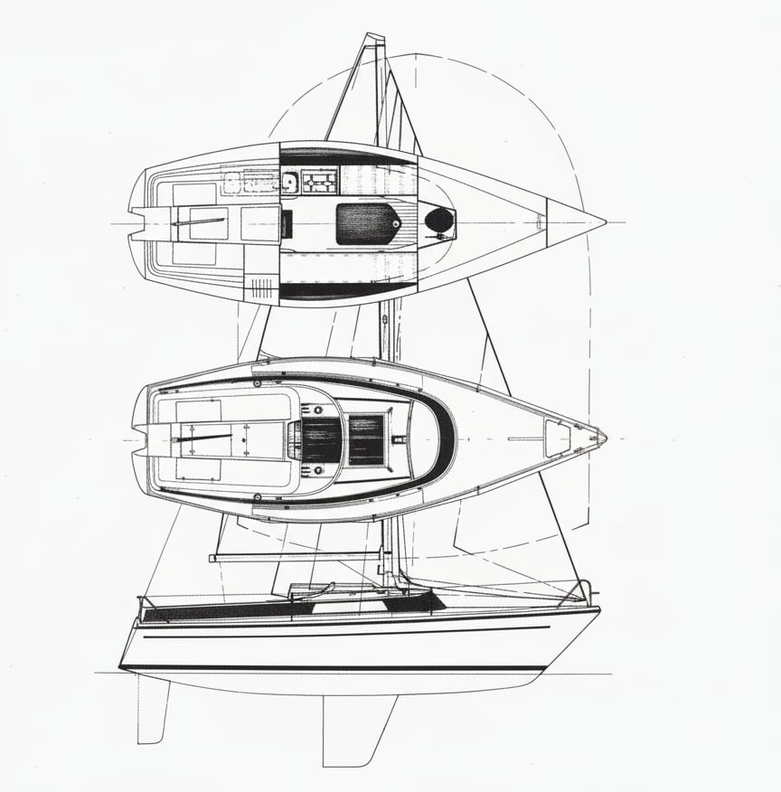

## Cuba Libre
Naše _Cuba Libre_ byla vyrobena v německé firmě Dehler, která byla založena v roce 1960 a vyrábí plachetnice do dnešního dne. Tato firma byla jedna z prvních, která rozpoznala velký potenciál a výhody stavby trupů ze sklolaminátu.  Jedná se o model **Spirita 70**, jehož první kus byl vyroben v roce 1975.

Loď je **ploutvo kýlové** konstrukce s **kormidlem zavěšeným na zrcadle**, jehož list je ovládán kormidelní pákou. Trup je ze sklolaminátu, díky čemuž je pevný, odolný a relativně lehký.

Oproti JOUËT 22 je  **Spirita 70** nejen delší, ale především širší a těžší, což se výrazně projevuje na jejích uživatelských vlastnostech. **Cuba Libre** nabízí více prostoru jak na palubě, tak v podpalubí, a při poryvech větru se méně naklání, což přispívá k pohodové a stabilní plavbě.

Je fér dodat, že ve srovnání s naší druhou lodí **Chillinou** (JOUËT 22) je **Cuba Libre**  o něco pomalejší a nedosahuje tak ostrých úhlů stoupání proti větru. Na druhou stranu je však díky své stabilitě, prostoru a klidnému chování na vodě ideální pro pohodové víkendové plavby, čímž se skvěle doplňuje s temperamentnější Chillinou.

| Specifikace | Hodnota |
|-------------|---------|
| Celková délka (LOA) | 7 m (22.97 ft) |
| Délka na hlavní vodorysce (LWL) | 5,8 m (19,03 ft) |
| Ponor | 1.25 m |
| Šířka | 2.45 m |
| Výtlak | 1,5 m³ |
| Balast | 600 Kg |
| Plocha plachet | 20 m² |
| Motor | závěsný |
| Maximální posádka | 4 |
| Počet lůžek | 4 |

Zdroje:
- https://mis.hanseyachtsag.com/website/document/sprinta-70-specifications-2015-spec_1390533075589789767.jpg
- https://sailboatdata.com/sailboat/sprinta-70/